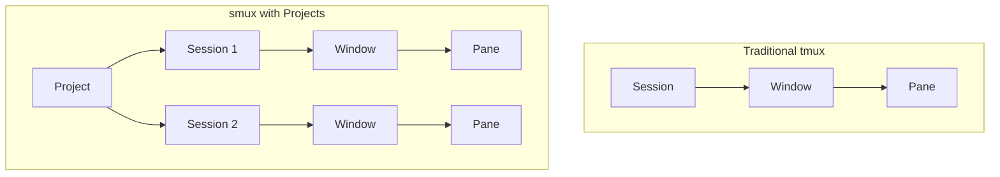
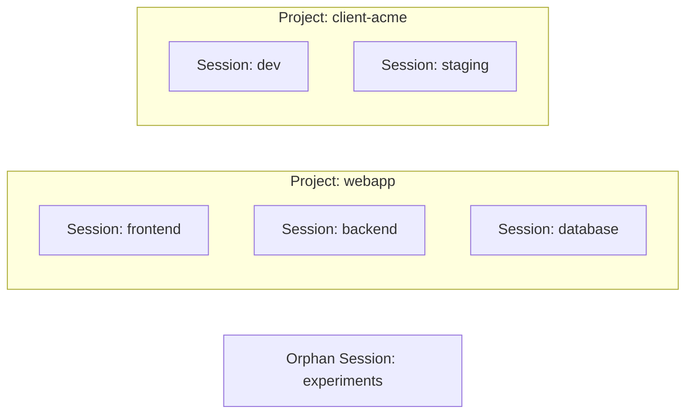
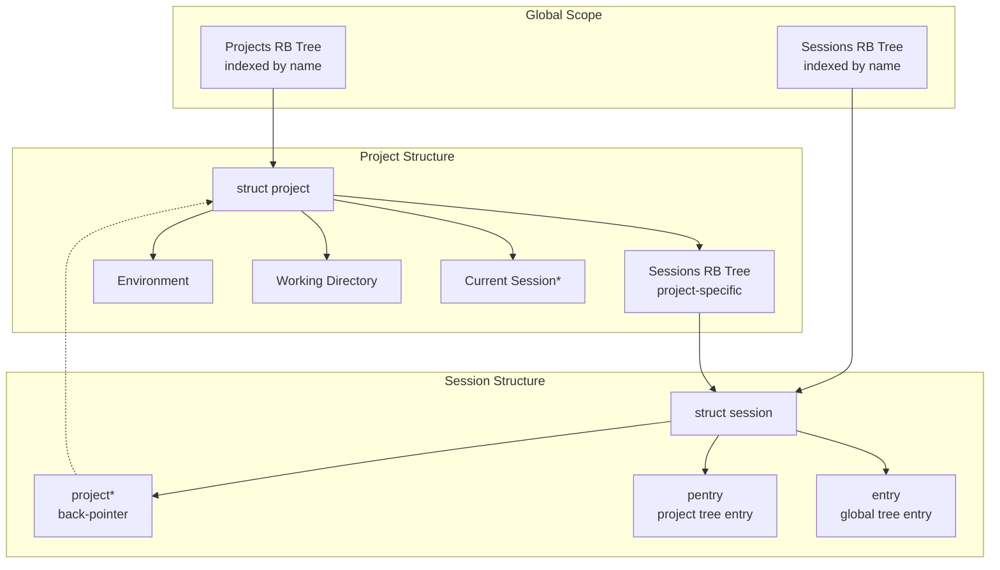
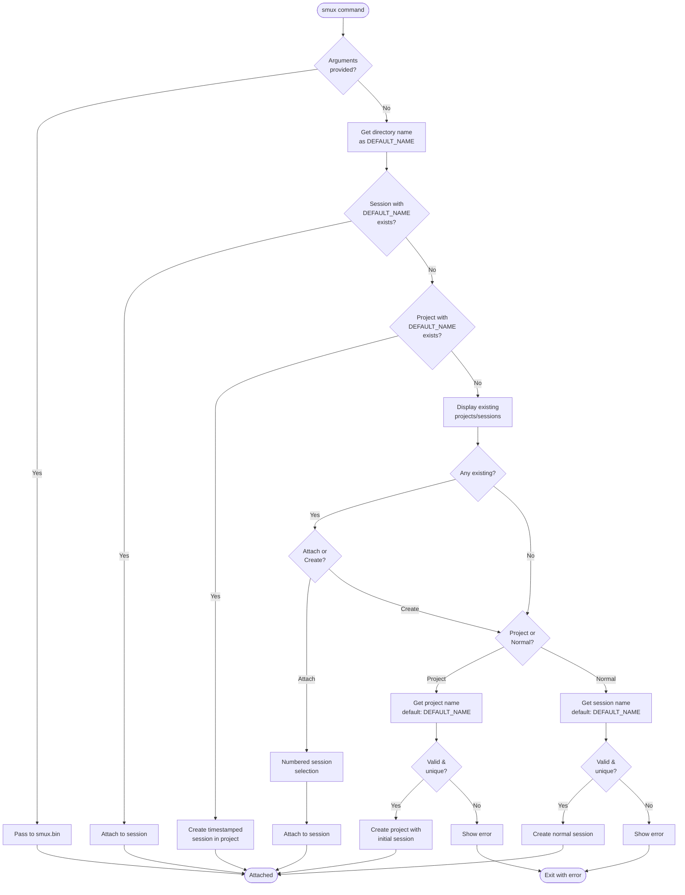
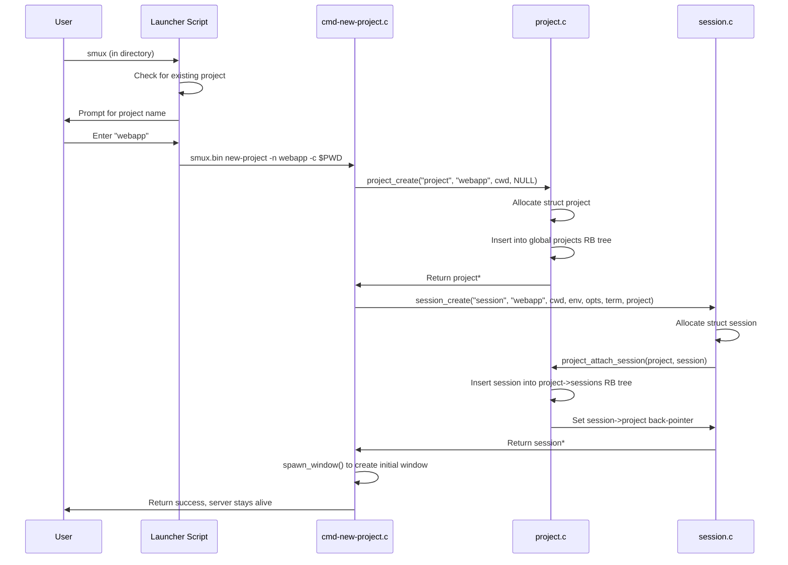
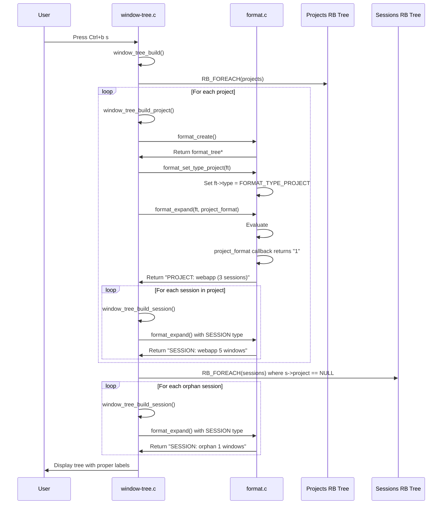

# smux - tmux with Project Management

**smux** is an enhanced fork of tmux that adds a project organizational layer on top of the traditional session-window-pane hierarchy. This addition enables developers to organize related terminal sessions under named projects, improving workspace management for complex multi-service applications.

## Table of Contents

- [Overview](#overview)
- [Why Projects?](#why-projects)
- [Architecture](#architecture)
- [Installation](#installation)
- [Quick Start](#quick-start)
- [Command Reference](#command-reference)
- [Technical Implementation](#technical-implementation)
- [Compatibility](#compatibility)
- [Contributing](#contributing)
- [License](#license)

## Overview

### Hierarchy Transformation

smux extends the traditional tmux hierarchy by adding a project layer:



**Traditional tmux:**
```
Session → Window → Pane
```

**smux with projects:**
```
Project → Session → Window → Pane
```

### Key Capabilities

- **Project Organization**: Group multiple related sessions under a single named project
- **Interactive Launcher**: Context-aware launcher that auto-detects directory names and existing projects
- **Visual Distinction**: Clear differentiation between projects and sessions in the interactive tree view
- **Session Management**: Quick attachment to existing sessions via numbered selection
- **Isolated Operation**: Runs alongside tmux using separate socket directories (`/tmp/smux-*` vs `/tmp/tmux-*`)
- **Full Compatibility**: Works with existing tmux configurations and keybindings

## Why Projects?

### Problem Statement

Traditional tmux sessions work well for single-service applications, but modern development often involves:

- **Multiple related services** (frontend, backend, database, cache)
- **Different environments** (development, staging, production)
- **Client-based work** (separate workspaces per client)
- **Team collaboration** (shared namespaces with multiple sessions)

Managing these scenarios with flat session lists becomes unwieldy as the number of sessions grows.

### Solution

The project layer provides:

1. **Logical Grouping**: Related sessions stay organized under a project namespace
2. **Context Switching**: Switch between entire project contexts (all sessions) with a single command
3. **Persistent Workspaces**: Projects persist across smux server restarts
4. **Clear Separation**: Orphan sessions (not in projects) remain visible but separate

### Use Case Examples



## Architecture

### Data Structure Overview



### Key Design Decisions

#### 1. Red-Black Trees for Efficient Lookups

Both projects and sessions use RB trees (self-balancing binary search trees) providing O(log n) lookup, insertion, and deletion:

```c
struct projects      projects;      // Global project tree
struct sessions      p->sessions;   // Per-project session tree
```

**Why RB trees?**
- Efficient for frequent lookups by name
- Automatic balancing maintains performance
- Standard OpenBSD tree.h implementation

#### 2. Dual Tree Membership for Sessions

Sessions exist in **two RB trees simultaneously**:

```c
struct session {
    RB_ENTRY(session) entry;   // Global sessions tree
    RB_ENTRY(session) pentry;  // Project's sessions tree
    struct project *project;   // Back-pointer to parent
};
```

**Why dual membership?**
- Global tree: Required for existing tmux commands (`list-sessions`, etc.)
- Project tree: Enables project-specific session iteration
- Back-pointer: Allows bidirectional navigation

#### 3. Reference Counting for Memory Safety

```c
void project_add_ref(struct project *p, const char *from);
void project_remove_ref(struct project *p, const char *from);
```

**Why reference counting?**
- Prevents use-after-free bugs during complex operations
- Allows deferred cleanup via `event_once()`
- Tracks lifetime across multiple ownership contexts

#### 4. Format Type System Extension

```c
enum format_type {
    FORMAT_TYPE_UNKNOWN,
    FORMAT_TYPE_PROJECT,    // NEW
    FORMAT_TYPE_SESSION,
    FORMAT_TYPE_WINDOW,
    FORMAT_TYPE_PANE
};
```

**Why extend format types?**
- Enables conditional formatting: `#{?project_format,<project>,<session>}`
- Properly distinguishes project context from session context
- Used by choose-tree to render correct labels (PROJECT: vs SESSION:)

### Interactive Launcher Flow



## Installation

### Prerequisites

- C compiler (gcc or clang)
- make
- ncurses development libraries
- libevent development libraries

**On Ubuntu/Debian:**
```bash
sudo apt-get install build-essential libevent-dev ncurses-dev
```

**On Arch Linux:**
```bash
sudo pacman -S base-devel libevent ncurses
```

**On macOS:**
```bash
brew install libevent ncurses
```

### Building from Source

```bash
# Clone the repository
git clone https://github.com/Swarm-Code/smux.git
cd smux

# Configure the build
./configure

# Compile (this may take a few minutes)
make

# Install to /usr/local/bin
sudo make install
```

### Installation Components

The installation creates two files:

1. **`/usr/local/bin/smux.bin`** - The actual smux binary (enhanced tmux)
2. **`/usr/local/bin/smux`** - Interactive launcher script (bash)

The launcher provides the directory-aware, interactive interface while the binary can still be invoked directly for programmatic usage.

### Verification

```bash
# Check installation
which smux
# Output: /usr/local/bin/smux

smux -V
# Output: smux 3.x (based on tmux)

# Check binary location
ls -la /usr/local/bin/smux*
# Output:
# -rwxr-xr-x 1 root root 5.3M ... /usr/local/bin/smux
# -rwxr-xr-x 1 root root 8.1M ... /usr/local/bin/smux.bin
```

## Quick Start

### Basic Workflow

**Step 1: Navigate to your project directory**
```bash
cd ~/code/my-web-app
```

**Step 2: Launch smux**
```bash
smux
```

**Step 3: Follow the interactive prompts**

On first run in a new directory, you'll see:
```
╔════════════════════════════════════════╗
║  Smux Interactive Launcher             ║
╚════════════════════════════════════════╝

ℹ  Current directory: /home/user/code/my-web-app
ℹ  No existing projects or sessions

❯ Create as [p]roject or [n]ormal session?
  (Projects organize multiple sessions, normal sessions are standalone)
  Choice (p/n):
```

**Step 4: Choose project type**
- Press `p` for project (recommended for multi-session work)
- Press `n` for normal session (single standalone session)

**Step 5: Confirm or customize name**
```
📁 Creating Project
  Project name [my-web-app]:
```
Press Enter to use the directory name, or type a custom name.

### Creating Additional Sessions in a Project

Once you have a project, creating new sessions is automatic:

```bash
cd ~/code/my-web-app
smux
```

Output:
```
ℹ  Current directory: /home/user/code/my-web-app
✓  Found existing project 'my-web-app'

▶  Creating new session 'my-web-app-1736453892' in project...
```

Sessions are auto-named with timestamps to avoid conflicts.

### Attaching to Existing Sessions

```bash
smux
```

When sessions exist:
```
📁 Existing Projects:
   │ my-web-app: 3 sessions

📋 Existing Sessions:
   │ my-web-app: 5 windows
   │ my-web-app-1736453892: 2 windows
   │ my-web-app-1736454100: 1 windows

❯ [a]ttach to existing or [c]reate new? a

Select a session to attach:
  1) my-web-app
  2) my-web-app-1736453892
  3) my-web-app-1736454100
Enter number: 1
```

### Visual Tree Navigation

Inside smux, press `Ctrl+b` then `s` to open the session tree:

```
PROJECT: my-web-app (3 sessions)
  └─ SESSION: my-web-app 5 windows (attached)
  └─ SESSION: my-web-app-1736453892 2 windows
  └─ SESSION: my-web-app-1736454100 1 windows
SESSION: orphan-session 1 windows
```

**Visual indicators:**
- **PROJECT:** prefix - Bold magenta with cyan name
- **SESSION:** prefix - Yellow with green "(attached)" when active
- Indentation shows project → session hierarchy

## Command Reference

### Project Management Commands

| Command | Alias | Syntax | Description |
|---------|-------|--------|-------------|
| `new-project` | `newp` | `new-project [-n name] [-c dir]` | Create a new project with an initial session |
| `list-projects` | `lsp` | `list-projects [-F format]` | List all projects with optional custom format |
| `kill-project` | - | `kill-project [-t target]` | Destroy a project (sessions become orphans) |
| `rename-project` | `renamep` | `rename-project [-t target] new-name` | Rename an existing project |
| `switch-project` | `switchp` | `switch-project [-t target]` | Switch to a project's current session |

### Enhanced Session Commands

| Command | Added Flag | Description |
|---------|------------|-------------|
| `new-session` | `-P project` | Create a session within a specified project |

**Examples:**

```bash
# Create a project directly
smux new-project -n webapp -c ~/code/webapp

# Create a session in a project
smux new-session -P webapp -s frontend

# List all projects
smux list-projects

# Switch to a project (attaches to its current session)
smux switch-project -t webapp

# Rename a project
smux rename-project -t webapp web-application

# Kill a project (sessions remain as orphans)
smux kill-project -t webapp
```

### Format Variables

Use these variables with `-F` flags or in status line configurations:

| Variable | Description | Example Output |
|----------|-------------|----------------|
| `#{project_name}` | Name of the project | `webapp` |
| `#{project_id}` | Project ID with # prefix | `#0` |
| `#{project_sessions}` | Number of sessions in project | `3` |
| `#{project_created}` | Project creation time | `1736453000` |
| `#{session_project}` | Project name (if session belongs to one) | `webapp` or empty |

**Example:**
```bash
smux list-projects -F "Project: #{project_name} (#{project_sessions} sessions)"
```

Output:
```
Project: webapp (3 sessions)
Project: client-acme (2 sessions)
```

### Conditional Formatting

Use `#{?project_format,<project>,<session>}` in choose-tree formats:

```bash
# In smux.conf
set -g @tree-format "#{?project_format,PROJECT: #{project_name},SESSION: #{session_name}}"
```

## Technical Implementation

### Files Added

The project layer is implemented across 6 new files:

| File | Lines | Purpose |
|------|-------|---------|
| `project.c` | 244 | Core project management (create, destroy, attach/detach sessions, reference counting) |
| `cmd-new-project.c` | 130 | Command handler for creating projects with initial session |
| `cmd-list-projects.c` | 91 | Command handler for listing projects with format support |
| `cmd-kill-project.c` | 85 | Command handler for destroying projects |
| `cmd-rename-project.c` | 108 | Command handler for renaming projects (RB tree reinsertion) |
| `cmd-switch-project.c` | 103 | Command handler for switching to a project's current session |

### Files Modified

Key modifications to existing tmux files:

| File | Changes | Why |
|------|---------|-----|
| `tmux.h` | Added `struct project` definition (11 fields)<br/>Added 14 project function declarations<br/>Added `project` field to `struct session`<br/>Added `format_set_type_project()` declaration | Defines core data structures and API |
| `project.c` | Complete implementation of project lifecycle | Core logic for project management |
| `format.c` | Added `FORMAT_TYPE_PROJECT` enum<br/>Added `format_cb_project_format()` callback<br/>Added `format_set_type_project()` helper | Enables conditional formatting based on project context |
| `window-tree.c` | Added `WINDOW_TREE_PROJECT` type<br/>Added `window_tree_build_project()` function<br/>Modified `window_tree_build()` with two-phase approach | Integrates projects into interactive choose-tree |
| `server.c` | Initialize `projects` RB tree on startup<br/>Cleanup projects on shutdown | Server lifecycle management |
| `session.c` | Initialize `s->project = NULL`<br/>Call `project_attach_session()` when project specified<br/>Call `project_detach_session()` on session destroy | Bidirectional project-session relationship |
| `cmd-new-session.c` | Added `-P project-name` flag<br/>Added project lookup logic | Allows creating sessions within projects |
| `cmd.c` | Registered 5 new project commands | Makes commands available to command parser |
| `Makefile.am` | Added 6 new source files | Build system integration |

### Critical Bug Fixes Implemented

#### 1. Double-Free in project_destroy()

**Problem:** Environment and cwd were freed in both `project_destroy()` and the deferred `project_free()` callback.

**Solution:** NULL assignment after freeing:
```c
environ_free(p->environ);
p->environ = NULL;  // Prevent double-free

free((void *)p->cwd);
p->cwd = NULL;      // Prevent use-after-free
```

#### 2. Server Shutdown on Project Creation

**Problem:** `new-project` created a project but no session, causing the server to immediately exit (tmux servers shut down when no sessions exist).

**Solution:** Modified `cmd-new-project.c` to automatically create an initial session with a window:
```c
s = session_create("session", p->name, cwd, env, oo, tiop, p);
p->curs = s;

memset(&sc, 0, sizeof sc);
sc.s = s;
sc.cwd = cwd;
spawn_window(&sc, &cause);
```

#### 3. FORMAT_TYPE_PROJECT Missing

**Problem:** Projects were displayed as "SESSION:" in choose-tree because no `FORMAT_TYPE_PROJECT` existed.

**Solution:** Added project format type and callback:
```c
enum format_type {
    FORMAT_TYPE_PROJECT,  // Added
    FORMAT_TYPE_SESSION,
    // ...
};

static void *format_cb_project_format(struct format_tree *ft) {
    if (ft->type == FORMAT_TYPE_PROJECT)
        return (xstrdup("1"));
    return (xstrdup("0"));
}
```

### Data Flow: Creating a Project



### Data Flow: Choose-Tree Display



## Differences from tmux

smux maintains full compatibility with tmux while adding project functionality. Key differences:

| Aspect | tmux | smux |
|--------|------|------|
| **Binary name** | `tmux` | `smux` (with `smux.bin` as actual binary) |
| **Socket directory** | `/tmp/tmux-*` | `/tmp/smux-*` |
| **Hierarchy** | Session → Window → Pane | Project → Session → Window → Pane |
| **Launcher** | Direct binary execution | Interactive launcher with auto-detection |
| **Choose-tree** | Sessions only | Projects + Sessions (with visual distinction) |
| **Configuration files** | `~/.tmux.conf` | `~/.smux.conf` (falls back to tmux.conf if not found) |

## Compatibility

### With tmux

- **Separate operation**: smux uses `/tmp/smux-*` sockets, so it can run alongside tmux
- **Config compatibility**: smux reads `~/.smux.conf`, `~/.config/smux/smux.conf`, or `/etc/smux.conf`
- **Command compatibility**: All tmux commands work in smux (sessions, windows, panes)
- **Keybinding compatibility**: Default bindings are identical to tmux

### Configuration Migration

To migrate from tmux to smux:

```bash
# Copy your tmux configuration
cp ~/.tmux.conf ~/.smux.conf

# Or symlink if you want to keep them in sync
ln -s ~/.tmux.conf ~/.smux.conf
```

### Interoperability

You can run both tmux and smux simultaneously:

```bash
# Start tmux session
tmux new -s mytmux

# In another terminal, start smux project
smux new-project -n myproject

# List tmux sessions (won't see smux)
tmux list-sessions

# List smux sessions (won't see tmux)
smux list-sessions
```

## Contributing

We welcome contributions to smux! Here's how to get involved:

### Reporting Issues

1. Check existing issues at https://github.com/Swarm-Code/smux/issues
2. Create a new issue with:
   - smux version (`smux -V`)
   - Operating system and version
   - Steps to reproduce
   - Expected vs actual behavior
   - Relevant logs (run with `smux -v` for verbose output)

### Development Setup

```bash
# Fork and clone the repository
git clone https://github.com/YOUR_USERNAME/smux.git
cd smux

# Create a development branch
git checkout -b feature/your-feature-name

# Make changes and test
./configure
make
sudo make install

# Run tests (if available)
make test

# Commit with descriptive messages
git add .
git commit -m "Add feature: description"

# Push and create pull request
git push origin feature/your-feature-name
```

### Code Style

smux follows the tmux coding style:

- **Indentation**: Tabs (8 spaces wide)
- **Braces**: K&R style (opening brace on same line)
- **Naming**: `snake_case` for functions and variables
- **Comments**: C-style `/* */` for multi-line, `//` for single-line
- **Line length**: Aim for 80 characters, 100 maximum

### Testing Checklist

Before submitting a PR, verify:

- [ ] Code compiles without warnings
- [ ] All existing tmux commands still work
- [ ] New project commands function as expected
- [ ] Choose-tree displays projects correctly
- [ ] Launcher script handles edge cases
- [ ] No memory leaks (test with valgrind if possible)
- [ ] Documentation updated (README, man pages)

### Areas for Contribution

Potential improvements:

1. **Project persistence**: Save/restore projects across reboots
2. **Nested projects**: Support for project hierarchies
3. **Project templates**: Predefined project layouts
4. **Enhanced filtering**: Filter projects by metadata
5. **Integration**: IDE plugins, shell completions
6. **Documentation**: Man pages, tutorials, video guides

## Support

### Getting Help

- **Documentation**: https://github.com/Swarm-Code/smux
- **Issues**: https://github.com/Swarm-Code/smux/issues
- **Discussions**: https://github.com/Swarm-Code/smux/discussions

### Troubleshooting

**Problem: "command not found: smux"**
- Solution: Ensure `/usr/local/bin` is in your PATH
- Check: `echo $PATH | grep /usr/local/bin`
- Fix: Add to `~/.bashrc` or `~/.zshrc`: `export PATH="/usr/local/bin:$PATH"`

**Problem: "failed to connect to server"**
- Solution: Start the smux server: `smux new-session -s test`
- Or: Use the launcher: `smux` (in any directory)

**Problem: "duplicate project" when creating**
- Solution: List existing projects: `smux list-projects`
- Then: Use a different name or kill the existing project

**Problem: Projects not showing in choose-tree**
- Solution: Ensure you're running the latest smux.bin
- Verify: `smux -V` should show smux version
- Reinstall: `cd smux && sudo make install`

## License

smux is licensed under the ISC License, the same as tmux.

```
ISC License

Copyright (c) 2025 Swarm Code Contributors
Copyright (c) 2007-2024 Nicholas Marriott and tmux contributors

Permission to use, copy, modify, and/or distribute this software for any
purpose with or without fee is hereby granted, provided that the above
copyright notice and this permission notice appear in all copies.

THE SOFTWARE IS PROVIDED "AS IS" AND THE AUTHOR DISCLAIMS ALL WARRANTIES
WITH REGARD TO THIS SOFTWARE INCLUDING ALL IMPLIED WARRANTIES OF
MERCHANTABILITY AND FITNESS. IN NO EVENT SHALL THE AUTHOR BE LIABLE FOR
ANY SPECIAL, DIRECT, INDIRECT, OR CONSEQUENTIAL DAMAGES OR ANY DAMAGES
WHATSOEVER RESULTING FROM LOSS OF USE, DATA OR PROFITS, WHETHER IN AN
ACTION OF CONTRACT, NEGLIGENCE OR OTHER TORTIOUS ACTION, ARISING OUT OF
OR IN CONNECTION WITH THE USE OR PERFORMANCE OF THIS SOFTWARE.
```

## Credits

**smux** is based on [tmux](https://github.com/tmux/tmux) by Nicholas Marriott and contributors.

Project management layer, interactive launcher, and enhancements developed by the Swarm Code team.

### Acknowledgments

- **Nicholas Marriott** - Original tmux author and maintainer
- **tmux contributors** - Robust terminal multiplexer foundation
- **OpenBSD project** - tree.h RB tree implementation
- **Swarm Code team** - Project management layer design and implementation
